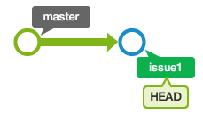
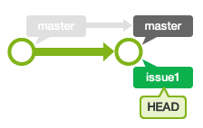
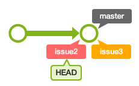
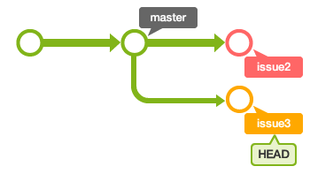
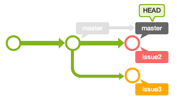
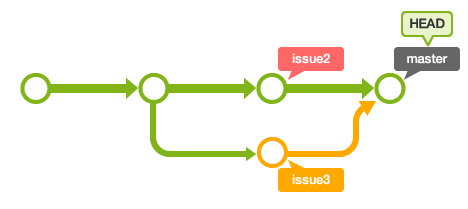
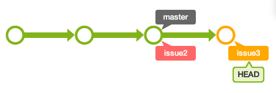
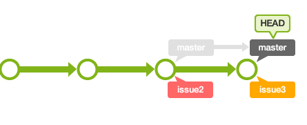

# GIT branch를 연습해보자!

- 참고 : [누구나 쉽게 이해할 수 있는 Git 입문](https://backlog.com/git-tutorial/kr/)

```bash
mkdir tutorial
cd tutorial
git init
```

- myfile.txt

`원숭이도 이해할 수 있는 git 명령어`

```bash
git add myfile.txt
git commit -m "first commit"
```

- issue1' 이라는 이름으로 새로운 브랜치를 작성

```bash
git branch issue1
```

- 브랜치 목록 전체를 확인 (앞에 *이 붙어있는 것이 현재 선택된 브랜치)

```bash
git branch
```

- 브랜치 전환하기
  - checkout 명령에 -b 옵션을 넣으면 브랜치 생성과 체크아웃을 한꺼번에 실행할 수 있음
  - 브랜치를 체크아웃한 상태에서 커밋을 수행하면 그 브랜치에 이력이 기록됨

```bash
git switch issue1
```




- 브랜치 병합하기
  - master 브랜치에 issue1을 넣기 위해서는 우선 master 브랜치에 HEAD가 위치하게 만들어야 함
  - checkout을 이용하여 브랜치를 master로 전환

```bash
git switch master
git merge issue1
```



- 브랜치 삭제하기
  - issue1 브랜치의 내용이 모두 master에 통합되었기 때문에 더 이상 issue1 브랜치가 필요 없게 됨

```bash
git branch -d issue1
```


- 동시에 여러 작업하기

```
git branch issue2
git branch issue3
```



```bash
git switch issue2 -> 내용 추가 -> add -> commit
git switch issue3 -> 내용 추가 -> add -> commit
```



```bash
#'issue2' 브랜치에서 변경한 부분과 'issue3' 브랜치에서 변경한 부분을 모두 'master' 브랜치에 통합
git switch master
git merge issue2
```



```bash
git merge issue3 -> CONFLICT 발생
```

- myfile.txt
  - 충돌이 일어난 부분은 일일이 확인해서 수정해 주어야 함

```txt
원숭이도 이해할 수 있는 Git 명령어
add: 변경 사항을 만들어서 인덱스에 등록해보기
<<<<<<< HEAD
commit: 인덱스 상태를 기록하기 
=======
pull: 원격 저장소의 내용을 가져오기 
>>>>>>> issue3

------------------------------------------------------------

원숭이도 이해할 수 있는 Git 명령어
add: 변경 사항을 만들어서 인덱스에 등록해보기
commit: 인덱스 상태를 기록하기 
pull: 원격 저장소의 내용을 가져오기 
```

```bash
git add myfile.txt
git commit -m "issue3 브랜치 병합"
```



- rebase로 병합하기
  - 일단 이전의 튜토리얼에서 마지막으로 진행했던 병합 명령을 취소

```bash
git reset --hard HEAD~
```

```bash
#'issue3' 브랜치로 전환하여 'master' 브랜치에 rebase 를 실행
git switch issue3
git rebase master-> 오류발생
```

- myfile.txt

```
원숭이도 이해할 수 있는 Git 명령어
add: 변경 사항을 만들어서 인덱스에 등록해보기
<<<<<<< HEAD
commit: 인덱스 상태를 기록하기 
=======
pull: 원격 저장소의 내용을 가져오기 
>>>>>>> 09bb75a (pull 설명을 추가)

------------------------------------------------
원숭이도 이해할 수 있는 Git 명령어
add: 변경 사항을 만들어서 인덱스에 등록해보기
commit: 인덱스 상태를 기록하기 
pull: 원격 저장소의 내용을 가져오기 
```

```bash
git add myfile.txt
git rebase --continue
```



```bash
#'master' 브랜치로 전환 하여 'issue3' 브랜치의 변경 사항을 모두 병합
git switch master
git merge issue3
```

